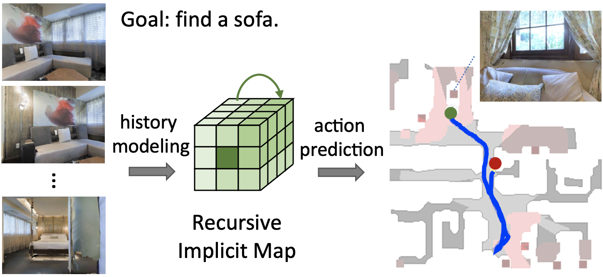

# Object Goal Navigation with Recursive Implicit Maps

This repository is the official implementation of [Object Goal Navigation with Recursive Implicit Maps](https://arxiv.org/abs/2308.05602) ([project webpage](https://cshizhe.github.io/projects/vil3dref.html)).



Object goal navigation aims to navigate an agent to locations of a given object category in unseen environments. Classical methods explicitly build maps of environments and require extensive engineering while lacking semantic information for object-oriented exploration. On the other hand, end-to-end learning methods alleviate manual map design and predict actions using implicit representations. Such methods, however, lack an explicit notion of geometry and may have limited ability to encode navigation history. In this work, we propose an implicit spatial map for object goal navigation. Our implicit map is recursively updated with new observations at each step using a transformer. To encourage spatial reasoning, we introduce auxiliary tasks and train our model to reconstruct explicit maps as well as to predict visual features, semantic labels and actions. Our method significantly outperforms the state of the art on the challenging MP3D dataset and generalizes well to the HM3D dataset. We successfully deploy our model on a real robot and achieve encouraging object goal navigation results in real scenes using only a few real-world demonstrations.


## Requirements
1. Clone the repository and install dependencies using the commands below.
```bash
git clone --recursive onav_rim
cd onav_rim

conda create -n onav python=3.8
conda activate onav

conda install pytorch==1.10.0 torchvision==0.11.0 torchaudio==0.10.0 cudatoolkit=10.2 -c pytorch

# install habitat-sim
cd dependencies/habitat-sim
pip install -r requirements.txt
./build.sh --headless --bullet  # for headless systems
# add habitat-sim to PYTHONPATH, for example add the following line to your .bashrc
export PYTHONPATH=$PYTHONPATH:/path/to/habitat-sim/
# avoid logging
export GLOG_minloglevel=2
export MAGNUM_LOG=quiet
cd ../..

# install CLIP
pip install ftfy regex tqdm
pip install git+https://github.com/openai/CLIP.git

# install the codebase
pip install -r requirements.txt
python setup.py develop --all
```

2. Download datasets

Follow the instructions in [habitat-web](https://github.com/Ram81/habitat-imitation-baselines#data) to download the MP3D scene dataset, object assets and demonstration datasets.

The data structure should look like this:
```
  ├── onav_rim/
  │  ├── data
  │  │  ├── ddppo-models/
  │  |  |  ├── gibson-2plus-resnet50.pth
  │  │  ├── rednet-models/
  │  │  │  ├── rednet_semmap_mp3d_tuned.pth
  │  │  ├── scene_datasets/
  │  │  │  ├── mp3d/
  │  │  ├── datasets
  │  │  │  ├── objectnav/
  │  │  │  │  ├── objectnav_mp3d_70k/
  │  │  │  │  │  ├── train/
  │  │  │  │  │── mp3d/
  │  │  │  │  │  ├── v1/
  │  │  │  │  │  │  ├── val/
  │  │  ├── test_assets/
  │  │  │  ├── objects/
```


## Usage

1. Pre-extract visual features:
We use [CLIP](https://github.com/openai/CLIP) and [a pretrained depth encoder](https://dl.fbaipublicfiles.com/habitat/data/baselines/v1/ddppo/ddppo-models/gibson-2plus-resnet50.pth) to extract visual features for RGB-D images.
```bash
python offline_bc/preprocess/extract_demo_observations.py \
  --cfg_file habitat_baselines/config/objectnav/il_ddp_objectnav.yaml \
  --scene_id gZ6f7yhEvPG \
  --save_semantic_fts --encode_depth --encode_rgb_clip \
  --outdir data/datasets/objectnav/mp3d_70k_demos_prefts
```

2. Train the model

```bash
# non-slurm servers
export WORLD_SIZE=1
export MASTER_ADDR='gpu003'
export MASTER_PORT=10000

configfile=offline_bc/config/onav_imap_single_transformer.yaml
python offline_bc/train_models.py --exp-config $configfile

# slurm servers
sbatch job_scripts/run_onav_offline_bc.sh
```

3. Evaluate the model
```bash
sbatch job_scripts/onav_eval_imap_transformers.sh

python evaluate_results $output_dir/results/val_pred_trajectories.jsonl
```

We provide a trained model in [Dropbox](https://www.dropbox.com/scl/fo/bk0ok8ibxd5yirohqjmu6/h?rlkey=4riilnmjgk0e4o5rxt3prtsfl&dl=0).


## Acknowledgements
Some of the codes are built upon [habitat-imitation-baselines](https://github.com/Ram81/habitat-imitation-baselines/tree/master). Thanks them for their great work!

